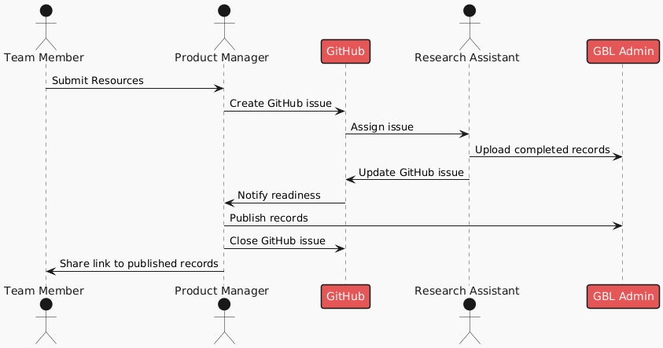

# Resource Lifecycle

The Resource Lifecycle describes how we manage resources from curation to ongoing maintenance.

## 1. Identify

:fontawesome-solid-user: BTAA-GIN Team Members and Product Manager 

Team members seek out new content for the geoportal. See the page [How to Submit Resources to the BTAA Geoportal](submit-resources.md) for more information.

## 2. Obtain and Process Metadata

### a. Harvest

:fontawesome-solid-user: Graduate Research Assistants and Product Manager 

This stage involves obtaining the metadata for resources.  At a minimum, this will include a title and and access link. However, it will ideally also include descriptions, dates, authors, rights, keywords, and more. 

Here are the most common ways that we obtain the metadata:

1. a BTAA-GIN Team Member sends us the metadata values as individual documents or as a combined spreadsheet
2. we are provided with (or are able to find) an API that will automatically generate the metadata in a structured file, such as JSON or XML
3. we develop a customized script to scrape directly from the HTML on a source's website
4. we manually copy and paste the metadata into a spreadsheet
5. a combination of one or more of the above

### b. Crosswalk

This step involves using a crosswalk to convert the metadata into the schema needed for the Geoportal. Our goal is to end up with a spreadsheet containing columns matching our [metadata template](https://z.umn.edu/b1g-template).

!!! info "Why do we rely on CSV?"

	CSV (Comma Separated Values) files organize tabular data in plain text format, where each row of data is separated by a line break, and each column of data is separated by a delimiter.
	
	We have found this tabular format to be the most human-readable way to batch create, edit, and troubleshoot metadata records. We can visually scan large numbers of records at once and normalize the values in ways that would be difficult with native nested formats, like JSON or XML. Therefore, many of our workflow processes involve transforming things to and from CSV.

### c. Edit

:fontawesome-solid-user: Graduate Research Assistants and Product Manager 

When working with metadata, it is common to come across missing or corrupted values, which require troubleshooting and manual editing in our spreadsheets. Refer to the [Collections Project Board](https://github.com/orgs/geobtaa/projects/4) for examples of this work.

### d. Validate

After compiling the metadata, we run a validation and cleaning script to ensure the records conform to the required elements of our schema. 

## 3. Index Metadata

:fontawesome-solid-user: Product Manager 

### a. Ingest to GBL Admin

We upload the completed spreadsheet to GBL Admin, which serves as the administrative interface for the Geoportal. If GBL Admin detects any formatting errors, it will issue a warning and may reject the upload.

### b. Publish new records to the Geoportal

Once the metadata is successfully uploaded to GBL Admin, we can publish the records to the Geoportal. The technology that actually stores the records and enables searching is called [Solr](https://solr.apache.org). 

### c. Unpublish

Periodically, we need to remove records from the Geoportal. To do this, we use GBL Admin to either delete them or change their status to "unpublished."

## 4. Maintenance

:fontawesome-solid-user: BTAA-GIN Team Members, Graduate Research Assistants, and Product Manager 

### a. Monitor sources

We monitor our sources to check for new and retired contnet.

### b. Monitor Geoportal

We regularly assess currentness of the content in the Geoportal and check for broken links.

### c. Schedule re-harvests

We schedule re-harvests from sources based on how frequently they update their content. See the [Collections Dashboard](https://github.com/orgs/geobtaa/projects/4) for this schedule.

##  Sequence diagram of processing workflow

This diagram illustrates the roles, tasks, and communication workflow for Team Members, the Product Mananger, and Research Assistants. The two technologies are GitHub for tracking work and GBL Admin for managing the metadata records.

<!--
plantUML code for the sequence chart

@startuml
!theme mars
actor "Team Member" as TM
actor "Product Manager" as PM
participant "GitHub" as GH
actor "Research Assistant" as RA
participant "GBL Admin" as GBL

TM -> PM : Submit Resources
PM -> GH : Create GitHub issue
GH -> RA : Assign issue

RA -> GBL : Upload completed records
RA -> GH : Update GitHub issue
GH -> PM : Notify readiness

PM -> GBL : Publish records
PM -> GH : Close GitHub issue
PM -> TM : Share link to published records
@enduml-->